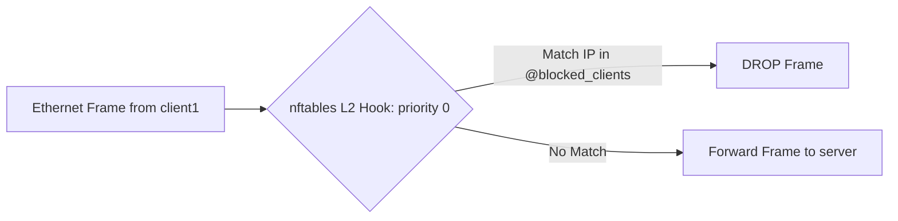

# Report 02: MCP Server & Low-Level Kernel Enforcement Deep Dive

---

## 1. Executive Summary

This report delivers a deep technical dive into the **Model Context Protocol (MCP) server layer** ([`mcp_server/server.py`](file:///home/dhruv/Documents/ina/mcp_server/server.py)) and the low-level Linux kernel enforcement mechanisms ([`mcp_server/tools.py`](file:///home/dhruv/Documents/ina/mcp_server/tools.py)).

The system translates structured tool invocations from the Assistant into real-time Linux kernel modifications, utilizing:
1. **`nftables` Layer-2 Bridge Set Filtering** for instant client blocking/unblocking across virtual ethernet bridges.
2. **Linux Traffic Control (`tc`) Token Bucket Filter (`tbf`)** for egress bandwidth throttling inside target container namespaces.

---

## 2. Model Context Protocol (MCP) Architecture

The MCP Server ([`mcp_server/server.py`](file:///home/dhruv/Documents/ina/mcp_server/server.py)) uses **FastMCP** (`fastmcp==3.4.7`) to expose standardized network control primitives over stdio or JSON-RPC.

```text
[ Assistant Orchestrator ]
         │
         │ (FastMCP JSON-RPC Tool Call)
         ▼
+-------------------------------------------------------------+
| mcp_server/server.py (FastMCP Server: "Network Assistant")  |
+-------------------------------------------------------------+
  ├── @mcp.tool() block(client: str)
  ├── @mcp.tool() unblock(client: str)
  └── @mcp.tool() limit(client: str, rate: str)
         │
         │ (Internal Function Dispatch)
         ▼
+-------------------------------------------------------------+
| mcp_server/tools.py (Subprocess Network Operations)          |
+-------------------------------------------------------------+
  ├── block_client()   ──> network.discovery.get_container_ip ──> nft drop
  ├── unblock_client() ──> network.discovery.get_container_ip ──> nft delete
  └── limit_bandwidth()──> network.discovery.get_container_ip ──> tc qdisc
```

> **Note on Dynamic Client IP Resolution**: `mcp_server/tools.py` no longer uses a static `CLIENT_IPS` dictionary. All tools dynamically query the Docker Engine API via `network.discovery.get_container_ip(client)` to resolve target IPv4 addresses in real time.


### 2.1 Tool Specifications

| MCP Tool Name | Function Signature | Input Parameters | Return Dictionary Structure | Execution Target Container |
| :--- | :--- | :--- | :--- | :--- |
| `block` | `block(client: str)` | `client`: Client ID (e.g. `"client1"`) | `{"status": "success"/"failure", "action": "block_client", "client": "...", "message": "..."}` | `network-controller` |
| `unblock` | `unblock(client: str)` | `client`: Client ID (e.g. `"client1"`) | `{"status": "success"/"failure", "action": "unblock_client", "client": "...", "message": "..."}` | `network-controller` |
| `limit` | `limit(client: str, rate: str)` | `client`: Client ID, `rate`: Speed string (e.g. `"5mbit"`) | `{"status": "success"/"failure", "action": "limit_bandwidth", "client": "...", "rate": "...", "message": "..."}` | `<client>` (e.g. `client1`) |

---

## 3. Layer-2 Bridge Filtering Mechanics (`nftables`)

### 3.1 The Bridge Filtering Problem

In Docker container networking, containers on the same bridge (`172.20.0.0/24`) communicate via **Layer-2 Ethernet frame switching**. Packets traveling between `client1` (`172.20.0.2`) and `server` (`172.20.0.3`) pass directly through the bridge interface (`network_project-net`) without escalating to the Layer-3 routing engine of the host.

Standard `iptables` rules placed in the `FORWARD` or `DOCKER-USER` chains operate at **Layer 3**. Without strict `br_netfilter` kernel hooks, bridged frames bypass `iptables` entirely.

### 3.2 The `nftables` Bridge Filtering Solution

To solve this, INA implements an `nftables` Layer-2 bridge filter inside [`mcp_server/tools.py`](file:///home/dhruv/Documents/ina/mcp_server/tools.py) via `_initialize_bridge_filter()`:

```python
def _initialize_bridge_filter() -> tuple[bool, str]:
    steps = [
        ("add", "table", "bridge", "network_filter"),
        ("add", "chain", "bridge", "network_filter", "forward",
         "{ type filter hook forward priority 0; policy accept; }"),
        ("add", "set", "bridge", "network_filter", "blocked_clients",
         "{ type ipv4_addr; }"),
    ]
```

#### Kernel Hierarchy Created in `nftables`:
1. **Table**: `bridge network_filter` (Operates specifically on L2 Ethernet frames).
2. **Chain**: `forward` hooked to `hook forward priority 0` with `policy accept`.
3. **Set**: `blocked_clients` containing dynamic `type ipv4_addr` elements.
4. **Rules**:
   * `nft add rule bridge network_filter forward ip saddr @blocked_clients drop`
   * `nft add rule bridge network_filter forward ip daddr @blocked_clients drop`



### 3.3 Block & Unblock Execution Commands

#### Blocking a Client (`block_client("client1")`):
Appends the client's static IP (`172.20.0.2`) to the `nftables` bridge set:
```bash
docker exec network-controller nft add element bridge network_filter blocked_clients { 172.20.0.2 }
```

#### Unblocking a Client (`unblock_client("client1")`):
Deletes the client's IP from the `nftables` bridge set and invokes `_cleanup_tc_qdiscs("client1")` to remove any active bandwidth throttling qdiscs/IFB devices:
```bash
# 1. Remove IP from bridge firewall set
docker exec network-controller nft delete element bridge network_filter blocked_clients { 172.20.0.2 }

# 2. Reset tc queuing disciplines and IFB devices (clears rate limits)
docker exec client1 tc qdisc del dev eth0 root 2>/dev/null
docker exec client1 tc qdisc del dev eth0 ingress 2>/dev/null
docker exec client1 tc qdisc del dev ifb0 root 2>/dev/null
docker exec client1 ip link delete dev ifb0 2>/dev/null
```

---

## 4. Bi-Directional Traffic Control (`tc`) Bandwidth Limiting

### 4.1 Bi-Directional Bandwidth Shaping Architecture (IFB + `mirred`)

Bandwidth limiting is enforced inside the target client container's network namespace using the Linux **Traffic Control (`tc`)** utility and an **Intermediate Functional Block (`ifb`)** pseudo-device.

Standard Linux `tc qdisc` on `eth0` only shapes **egress (outgoing)** traffic. To throttle **ingress (incoming)** traffic as well, INA redirects incoming frames from `eth0` to a virtual `ifb0` device and applies an ingress TBF qdisc to `ifb0`.

#### Execution Lifecycle (`limit_bandwidth(client, rate)`):

1. **Cleanup Existing Qdiscs & Devices (`_cleanup_tc_qdiscs`)**:
   Deletes existing qdiscs on `eth0` root, `eth0` ingress (`ffff:`), and `ifb0` root, then deletes the `ifb0` link to ensure a clean state.
2. **Create & Activate IFB Pseudo-Device**:
   ```bash
   docker exec client1 ip link add dev ifb0 type ifb
   docker exec client1 ip link set dev ifb0 up
   ```
3. **Configure Egress Shaping on `eth0` Root**:
   ```bash
   docker exec client1 tc qdisc replace dev eth0 root tbf rate 5mbit burst 32kbit latency 400ms
   ```
4. **Attach Ingress Hook to `eth0`**:
   ```bash
   docker exec client1 tc qdisc add dev eth0 handle ffff: ingress
   ```
5. **Redirect Ingress Traffic to `ifb0`**:
   ```bash
   docker exec client1 tc filter add dev eth0 parent ffff: protocol ip u32 match u32 0 0 action mirred egress redirect dev ifb0
   ```
6. **Configure Ingress Shaping on `ifb0` Root**:
   ```bash
   docker exec client1 tc qdisc replace dev ifb0 root tbf rate 5mbit burst 32kbit latency 400ms
   ```

### 4.2 Mathematical & Technical Parameter Breakdown

```text
                                [ Egress Traffic Path ]
Packet Stream Out ---> [ TBF Queue on eth0 (Rate R, Latency 400ms) ] ---> Transmit eth0

                                [ Ingress Traffic Path ]
Packet Stream In  ---> eth0 Ingress Hook (ffff:)
                               │
                               │ (tc filter mirred redirect)
                               ▼
                        [ ifb0 Pseudo-Device ] ---> [ TBF Queue on ifb0 (Rate R, Latency 400ms) ] ---> Receive
```

1. **`rate 5mbit` ($R$)**:
   The sustained maximum transfer rate (5 Megabits per second) enforced independently in both ingress and egress directions.
2. **`burst 32kbit` ($B$)**:
   The token bucket capacity (32 Kilobits), allowing instantaneous burst transmission up to line speed before rate limiting engages.
3. **`latency 400ms` ($L$)**:
   The maximum queue buffering latency permitted before packet drops occur ($Queue\_Bytes = R \times L$).

### 4.3 Querying Active Traffic Control Rules

To inspect live bi-directional `tc` rules inside `client1`:

```bash
# View egress qdisc on eth0
docker exec client1 tc qdisc show dev eth0

# View ingress redirection filter on eth0
docker exec client1 tc filter show dev eth0 parent ffff:

# View ingress qdisc on ifb0
docker exec client1 tc qdisc show dev ifb0
```

* **Expected Egress Output (`eth0`)**:
  `qdisc tbf 8001: root refcnt 2 rate 5Mbit burst 4Kb lat 400.0ms`
* **Expected Ingress Output (`ifb0`)**:
  `qdisc tbf 8001: root refcnt 2 rate 5Mbit burst 4Kb lat 400.0ms`

---

## 5. Subprocess Execution & Failure Handling Matrix

In [`mcp_server/tools.py`](file:///home/dhruv/Documents/ina/mcp_server/tools.py), all CLI tools are executed using `subprocess.run` with `capture_output=True, text=True, check=False`.

| Scenario | Subprocess Exit Code | `stderr` Pattern | MCP Tool Outcome Returned |
| :--- | :--- | :--- | :--- |
| **Successful Block** | `0` | Clean | `{"status": "success", "message": "Client client1 blocked successfully..."}` |
| **Duplicate Block** | `1` | `File exists` | `{"status": "success", "message": "Client client1 is already blocked."}` |
| **Duplicate Unblock** | `1` | `No such file/element` | `{"status": "success", "message": "Client client1 is already unblocked."}` |
| **Docker Daemon Down** | N/A | `FileNotFoundError` | `{"status": "failure", "message": "Docker command not found..."}` |
| **Invalid Client** | N/A | None | `{"status": "failure", "message": "Client unknown not found..."}` |

---

## 6. Key Takeaways for Examination & Defense

1. **Why `nftables` over legacy `iptables`?**  
   `nftables` provides native, performant Layer-2 bridge table hooks (`table bridge`) and dynamic IP sets (`set blocked_clients`), allowing $O(1)$ set lookups instead of traversing linear `iptables` rule chains ($O(N)$).
2. **Why is IFB required for ingress bandwidth limiting?**  
   Linux `tc qdisc` directly shapes egress traffic only. By redirecting `eth0` ingress traffic to an IFB (`ifb0`) interface via `tc filter mirred egress redirect`, `tc` can apply a TBF qdisc to `ifb0` to throttle incoming bandwidth.
3. **What happens if a rate of `100mbit` is requested?**  
   The MCP server would execute it, but the upstream **Policy Engine** intercepts and denies rates above `20mbit` before MCP execution is triggered.
