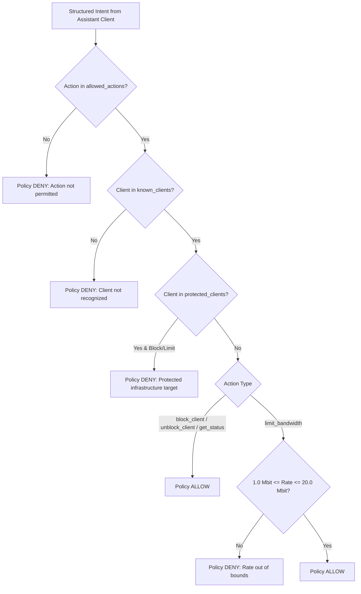

# Report 03: Policy Engine & Audit Governance Deep Dive

---

## 1. Executive Summary

This report analyzes the rule enforcement, policy evaluation, rate parsing, and audit logging subsystems governing the **Intelligent Network Configuration Assistant (INA)**.

The Policy Engine ([`policy/policy_engine.py`](file:///home/dhruv/Documents/ina/policy/policy_engine.py)) acts as an isolated zero-trust decision barrier between natural-language user intent and low-level Linux kernel tools. It enforces deterministic security policies defined in [`policy/rules.yaml`](file:///home/dhruv/Documents/ina/policy/rules.yaml) and maintains a persistent, append-only JSONL audit trail via [`policy/audit_log.py`](file:///home/dhruv/Documents/ina/policy/audit_log.py).

---

## 2. Policy Engine Architecture & Guardrails

The Policy Engine intercepts every requested action before network execution occurs. It does **not** communicate with Docker, `iptables`, or `tc` directly; its sole responsibility is returning an immutable `PolicyResult(allowed: bool, reason: str)`.



---

## 3. Rulebook Configuration (`policy/rules.yaml`)

The system configuration file [`policy/rules.yaml`](file:///home/dhruv/Documents/ina/policy/rules.yaml) establishes the network guardrails in plain YAML:

```yaml
# policy/rules.yaml

# Protected infrastructure hosts that can NEVER be blocked or bandwidth-limited
protected_clients:
  - server

# Bandwidth rate constraints enforced for limit_bandwidth operations
bandwidth:
  minimum: 1mbit
  maximum: 20mbit

# Explicitly permitted network control operations
allowed_actions:
  - block_client
  - unblock_client
  - limit_bandwidth
  - get_status

# White-listed hostnames in the container environment
known_clients:
  - client1
  - client2
  - server
```

---

## 4. Policy Decision Algorithm (`policy/policy_engine.py`)

### 4.1 Data Schema

The policy evaluation logic ([`policy/policy_engine.py`](file:///home/dhruv/Documents/ina/policy/policy_engine.py)) defines a dataclass to encapsulate decision outputs:

```python
@dataclass
class PolicyResult:
    allowed: bool
    reason: str
```

### 4.2 Rate Parsing Engine (`_parse_mbit`)

To support diverse unit strings supplied by users or LLM intent parsers (e.g. `"5mbit"`, `"5 Mbps"`, `"5mb/s"`, `5`), the policy engine utilizes a unit conversion function:

```python
def _parse_mbit(value):
    if isinstance(value, (int, float)):
        return float(value)
    text = str(value).strip().lower()
    for suffix in ("mbit", "mbps", "mb/s"):
        text = text.replace(suffix, "")
    return float(text.strip())
```

### 4.3 Validation Step Execution

When `check_policy(action: str, params: dict)` is invoked:
1. **Action Whitelist Verification**: Checks if `action` exists in `allowed_actions`. Returns `PolicyResult(False, ...)` if unauthorized.
2. **Known Client Lookup**: Checks if `params["client"]` exists in `known_clients`. Prevents spoofed or non-existent target names.
3. **Protected Client Guard**: Rejects `block_client` or `limit_bandwidth` requests targeting `server` (returns `"'server' is a protected client and cannot be blocked."`).
4. **Bandwidth Bounds Enforcement**: Parses bandwidth rate and validates that $1.0\text{ Mbit} \le \text{rate\_val} \le 20.0\text{ Mbit}$. Rejects values out of bounds (e.g., `0.5mbit` or `25mbit`).

---

## 5. Audit Logging & Governance (`policy/audit_log.py`)

### 5.1 Append-Only Audit Trail (`policy/audit_log.jsonl`)

Every policy decision (`ALLOWED` or `DENIED`) and subsequent network execution (`APPLIED`) is appended as a structured JSON object to [`policy/audit_log.jsonl`](file:///home/dhruv/Documents/ina/policy/audit_log.jsonl):

```python
def log_action(action: str, params: dict, status: str, reason: str = ""):
    entry = {
        "timestamp": datetime.now().isoformat(timespec="seconds"),
        "action": action,
        "params": params,
        "status": status,  # "ALLOWED", "DENIED", or "APPLIED"
        "reason": reason,
    }
    with open(LOG_PATH, "a") as f:
        f.write(json.dumps(entry) + "\n")
    return entry
```

### 5.2 Example Audit Log Entries

```json
{"timestamp": "2026-09-07T14:10:02", "action": "block_client", "params": {"client": "server"}, "status": "DENIED", "reason": "'server' is a protected client and cannot be blocked."}
{"timestamp": "2026-09-07T14:10:15", "action": "block_client", "params": {"client": "client1"}, "status": "ALLOWED", "reason": "'client1' is not protected. Block permitted."}
{"timestamp": "2026-09-07T14:10:16", "action": "block_client", "params": {"client": "client1"}, "status": "APPLIED", "reason": "Client client1 blocked successfully at bridge level."}
```

### 5.3 Explainability Engine (`explain_action`)

The governance layer provides natural-language explainability via `explain_action(index=-1)`:

```python
def explain_action(index: int = -1):
    logs = get_all_logs()
    if not logs:
        return "No actions have been logged yet."
    entry = logs[index]
    verb = {"ALLOWED": "allowed", "DENIED": "denied", "APPLIED": "applied"}.get(entry["status"])
    return f"I {verb} the request to {entry['action']} with params {entry['params']} because: {entry['reason']}"
```

---

## 6. Key Governance Takeaways for Examination

1. **Why is the Policy Engine decoupled from network execution?**  
   To enforce zero-trust security architecture. Decoupling ensures that even if an LLM hallucinates an unsafe command, the Policy Engine prevents kernel command generation.
2. **What prevents an attacker from bypassing bandwidth limits?**  
   `rules.yaml` strictly bounds rates between 1 Mbps and 20 Mbps, preventing denial-of-service throttling or link saturation.
3. **How is explainability achieved?**  
   Through structured `.jsonl` logging capturing decision reasons alongside timestamps, queryable via `explain_action()`.
