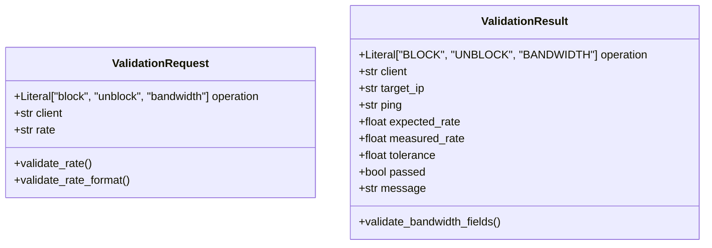

# Report 04: Network Validation & Monitoring Layer Deep Dive

---

## 1. Executive Summary

This report delivers an exhaustive technical analysis of the active network validation and performance monitoring engine ([`validation/monitor.py`](file:///home/dhruv/Documents/ina/validation/monitor.py)) and data models ([`validation/models.py`](file:///home/dhruv/Documents/ina/validation/models.py)).

The validation layer provides empirical proof of network state convergence following MCP execution. Rather than assuming a command succeeded based on subprocess return codes, the validation engine actively probes the Linux bridge using ICMP packet loss analysis and `iperf3` JSON throughput benchmarking.

---

## 2. Pydantic v2 Validation Schemas (`validation/models.py`)

The validation layer utilizes **Pydantic v2** models to validate incoming measurement requests and structure output validation reports.



### 2.1 Request Schema Validation (`ValidationRequest`)

The `ValidationRequest` model enforces strict field relationship constraints:
1. **Rate Dependency**: If `operation == "bandwidth"`, `rate` cannot be `None`. Conversely, non-bandwidth operations reject rate parameters.
2. **Unit Format Verification**: `validate_rate_format()` normalizes rate strings and validates suffix units (`kbit`, `mbit`, `gbit`). Rates must be positive floating-point numbers.

### 2.2 Result Schema Validation (`ValidationResult`)

The `ValidationResult` model standardizes output reporting. For `BANDWIDTH` operations, `@model_validator` mandates the presence of `expected_rate`, `measured_rate`, and `tolerance`.

---

## 3. Active Probing & Bridge Traversal Architecture

### 3.1 The Host-Ping Bypass Problem & Solution

A critical networking challenge discovered during development was the **Host Ping Bypass**:
* When `block_client("client1")` inserts an `nftables` bridge rule, it targets bridged Layer-2 traffic between virtual interfaces.
* If a ping test is launched directly from the **host OS** or from the host-networked `network-controller`, the traffic originates from the host network stack (Layer-3 OUTPUT hook) and bypasses the bridge forwarding hook entirely, returning a false positive `"Reachable"`.

### 3.2 Sibling Container Routing (`pick_source_container`)

To ensure ping packets traverse the Layer-2 bridge hook where `nftables` rules are active, [`validation/monitor.py`](file:///home/dhruv/Documents/ina/validation/monitor.py) implements `pick_source_container()`:

```python
def pick_source_container(target_client):
    _ = get_ip(target_client)  # Dynamically verifies target container
    known = list_known_clients() # Dynamic discovery via Docker SDK
    candidates = ["server", "client1", "client2", *known.keys()]

    for candidate in candidates:
        if candidate != target_client:
            try:
                get_container_ip(candidate)
                return candidate
            except Exception:
                continue
    raise ValueError(f"No available source container to ping from for target '{target_client}'.")
```


```text
[ FALSE POSITIVE PATH (Bypasses Filter) ]
Host / Controller ---> IP Routing ---> client1 (Reachable!)

[ ACCURATE VALIDATION PATH (Traverses Filter Hook) ]
client2 (172.20.0.4) ---> project-net Bridge -X (nftables DROP) -> client1 (172.20.0.2)
```

---

## 4. Empirical Verification Mechanisms

### 4.1 ICMP Block Verification (`check_block`)

To verify `block_client("client1")`:
1. Selects sibling container (e.g. `server` or `client2`).
2. Runs: `docker exec client2 ping -c 3 -W 1 172.20.0.2`.
3. Parses output with regex `parse_packet_loss(output)`:
   ```python
   match = re.search(r"(\d+(?:\.\d+)?)%\s*packet loss", output)
   ```
4. **Pass Criteria**: `packet_loss >= 100.0%` (Confirms client is completely blocked).

### 4.2 ICMP Unblock Verification (`check_unblock`)

To verify `unblock_client("client1")`:
1. Executes sibling container ping check.
2. **Pass Criteria**: `packet_loss < 100.0%` (Confirms network connectivity restored).

### 4.3 Bi-Directional `iperf3` Throughput Verification (`check_bandwidth`)

To empirically verify bi-directional bandwidth limits (`limit_bandwidth("client1", "5mbit")`), `validation/monitor.py` measures both **egress (outgoing)** and **ingress (incoming)** throughput against `server`.

#### Step 1: Server Socket Probing (`ensure_iperf_server`)
Before benchmarking, inspects TCP port `5201` on `server` using `ss`:
```bash
docker exec server sh -c "ss -lnt 2>/dev/null | grep -q ':5201 '"
```
If inactive, spawns background daemon: `docker exec -d server iperf3 -s`.

#### Step 2: Bi-Directional JSON Benchmark Execution (`run_iperf`)
Executes 5-second `iperf3` tests in both directions formatted in JSON (`-J`):

1. **Egress Throughput Check** (`client1 -> server`):
   ```bash
   docker exec client1 iperf3 -c 172.20.0.3 -t 5 -J
   ```
2. **Ingress Throughput Check** (`server -> client1` via Reverse mode `-R`):
   ```bash
   docker exec client1 iperf3 -c 172.20.0.3 -t 5 -R -J
   ```

#### Step 3: Dual-Direction Rate Parsing & Tolerance Verification
Parses `end.sum_received.bits_per_second` (or `end.sum_sent.bits_per_second` for reverse mode) and converts to Mbps for both checks:
```python
def bandwidth_within_tolerance(measured, expected):
    lower_limit = expected * (1 - BANDWIDTH_TOLERANCE) # expected * 0.80
    upper_limit = expected * (1 + BANDWIDTH_TOLERANCE) # expected * 1.20
    return lower_limit <= measured <= upper_limit
```

* **Target Rate**: `5.0 Mbps`
* **Tolerance Window**: `4.0 Mbps` to `6.0 Mbps` ($\pm 20\%$)
* **Egress Measured**: `~4.64 Mbps` -> **Status**: `PASS`
* **Ingress Measured**: `~4.54 Mbps` -> **Status**: `PASS`
* **Overall Outcome**: PASS only if **both** egress and ingress measurements fall within tolerance.

---

## 5. Console Diagnostics & CLI Usage

The validation module can be executed standalone from the host command line:

```bash
# Validate block operation on client1
python3 validation/monitor.py block client1

# Validate unblock operation on client1
python3 validation/monitor.py unblock client1

# Validate 5 Mbps bandwidth limit on client1
python3 validation/monitor.py bandwidth client1 5mbit
```

### Sample Output:
```text
Validation: BANDWIDTH
Target: client1
Target IP: 172.20.0.2
Expected Rate: 5.00 Mbps
Measured Rate: 4.86 Mbps
Tolerance: ±20%
Result: PASS
Message: Bandwidth is within the expected range.
```

---

## 6. Key Validation Takeaways for Examination

1. **Why does validation use `iperf3 -J` instead of plain text output?**  
   JSON output (`-J`) provides exact bitrates in `bits_per_second` without string parsing errors associated with human-readable unit changes (e.g. `Kbits/sec` vs `Mbits/sec`).
2. **What is the significance of `pick_source_container()`?**  
   It eliminates host-bypass false positives by ensuring ICMP echo requests originate within a container on the bridge network.
3. **What is the default bandwidth tolerance?**  
   $\pm 20\%$ (`BANDWIDTH_TOLERANCE = 0.20`), accounting for TCP congestion control window warmup and queuing overhead.
