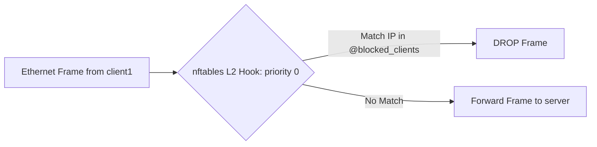

# Report 02: MCP Server & Low-Level Kernel Enforcement Deep Dive

---

## 1. Executive Summary

This report delivers an in-depth technical analysis of the **Model Context Protocol (MCP) server layer** ([`code/mcp_server/server.py`](file:///home/dhruv/Documents/ina/code/mcp_server/server.py)) and the low-level Linux kernel enforcement primitives ([`code/mcp_server/tools.py`](file:///home/dhruv/Documents/ina/code/mcp_server/tools.py)).

The system translates structured tool invocations from the Assistant into real-time Linux kernel modifications, utilizing:
1. **`nftables` Layer-2 Bridge Set Filtering** for instant client blocking/unblocking across virtual Ethernet bridges.
2. **Bi-Directional Traffic Control (`tc`)** using Token Bucket Filters (`tbf`) and Intermediate Functional Block (`ifb`) pseudo-devices for ingress and egress bandwidth throttling inside target container namespaces.
3. **Integrated Policy Authorization & Audit Logging** enforcing zero-trust compliance before kernel operations are dispatched.

---

## 2. Model Context Protocol (MCP) Architecture

The MCP Server ([`code/mcp_server/server.py`](file:///home/dhruv/Documents/ina/code/mcp_server/server.py)) utilizes **FastMCP** (`fastmcp==3.4.7`) to expose standardized network control primitives over stdio or JSON-RPC.

```text
[ Assistant Orchestrator ]
         │
         │ (FastMCP Tool Call: block, unblock, limit, get_status)
         ▼
+-------------------------------------------------------------+
| mcp_server/server.py (FastMCP Server: "Network Assistant")  |
+-------------------------------------------------------------+
  ├── @mcp.tool() block(client: str)
  ├── @mcp.tool() unblock(client: str)
  ├── @mcp.tool() limit(client: str, rate: str)
  └── @mcp.tool() status(client: str)
         │
         │ (Internal Function Dispatch & Input Validation)
         ▼
+-------------------------------------------------------------+
| mcp_server/tools.py (Subprocess Network Operations)          |
+-------------------------------------------------------------+
  ├── block_client()   ──> check_policy() ──> nft add element
  ├── unblock_client() ──> check_policy() ──> _cleanup_tc_qdiscs() ──> nft delete
  ├── limit_bandwidth()──> check_policy() ──> IFB creation ──> tc tbf (eth0 & ifb0)
  └── get_status()     ──> inspect nft set + tc qdiscs + ping reachability
```

### 2.1 Tool Specifications & Security Validation Matrix

All input parameters undergo strict sanitization before executing subprocess commands to prevent shell command injection or arbitrary container targeting:

```python
_CLIENT_NAME_RE = re.compile(r"^[a-zA-Z0-9][a-zA-Z0-9_.-]{0,63}$")
_DISALLOWED_TARGETS = {"network-controller", "host", "root", "docker", "bridge"}

def _validate_client(client: str) -> str:
    cleaned = client.strip()
    if not _CLIENT_NAME_RE.match(cleaned) or cleaned.startswith("-") or cleaned.lower() in _DISALLOWED_TARGETS:
        raise ValueError(f"Invalid or disallowed client identifier: '{client}'.")
    return cleaned
```

| MCP Tool Name | Function Signature | Input Parameters | Security Sanitization Rules | Execution Target Container |
| :--- | :--- | :--- | :--- | :--- |
| `block` | `block(client: str)` | `client`: Hostname/ID | `_validate_client()` (Regex `^[a-zA-Z0-9_.-]+$`, block injection) | `network-controller` |
| `unblock` | `unblock(client: str)` | `client`: Hostname/ID | `_validate_client()` & `_validate_ipv4()` | `network-controller` & Target Container |
| `limit` | `limit(client: str, rate: str)` | `client`, `rate`: Speed (e.g. `"5mbit"`) | `_validate_rate()` (`kbit`/`mbit`/`gbit`, `mbps` normalization) | Target Container (e.g., `client1`) |
| `status` | `status(client: str)` | `client`: Optional ID | Accepts `"all"`, `""`, or valid target client name | `network-controller` & Target Container |

---

## 3. Layer-2 Bridge Filtering Mechanics (`nftables`)

### 3.1 The Bridge Filtering Problem

In Docker container networking, containers on the same bridge (`172.20.0.0/24`) communicate via **Layer-2 Ethernet frame switching**. Packets traveling between `client1` (`172.20.0.2`) and `server` (`172.20.0.3`) pass directly through the bridge interface (`network_project-net`) without escalating to the host Layer-3 IP routing stack.

Standard `iptables` rules in `FORWARD` or `DOCKER-USER` chains operate at **Layer 3**. Without strict `br_netfilter` kernel hooks, bridged frames bypass `iptables` entirely.

### 3.2 The `nftables` Bridge Filtering Solution

To solve this, INA implements an `nftables` Layer-2 bridge filter inside [`code/mcp_server/tools.py`](file:///home/dhruv/Documents/ina/code/mcp_server/tools.py) via `_initialize_bridge_filter()`:

```python
def _initialize_bridge_filter() -> tuple[bool, str]:
    steps = [
        ("add", "table", "bridge", "network_filter"),
        ("add", "chain", "bridge", "network_filter", "forward",
         "{ type filter hook forward priority 0; policy accept; }"),
        ("add", "set", "bridge", "network_filter", "blocked_clients",
         "{ type ipv4_addr; }"),
    ]
```

#### Kernel Hierarchy Created in `nftables`:
1. **Table**: `bridge network_filter` (Operates specifically on L2 Ethernet frames).
2. **Chain**: `forward` hooked to `hook forward priority 0` with `policy accept`.
3. **Set**: `blocked_clients` containing dynamic `type ipv4_addr` elements.
4. **Rules**:
   * `nft add rule bridge network_filter forward ip saddr @blocked_clients drop`
   * `nft add rule bridge network_filter forward ip daddr @blocked_clients drop`



### 3.3 Block & Unblock Execution Commands

#### Blocking a Client (`block_client("client1")`):
Appends the client's dynamic IPv4 address (`172.20.0.2`) to the `nftables` bridge set:
```bash
docker exec network-controller nft add element bridge network_filter blocked_clients { 172.20.0.2 }
```

#### Unblocking a Client (`unblock_client("client1")`):
Deletes the client's IP from the `nftables` bridge set and invokes `_cleanup_tc_qdiscs("client1")` to remove any active bandwidth throttling qdiscs/IFB devices:
```bash
# 1. Remove IP from bridge firewall set
docker exec network-controller nft delete element bridge network_filter blocked_clients { 172.20.0.2 }

# 2. Reset tc queuing disciplines and IFB devices (clears rate limits)
docker exec client1 tc qdisc del dev eth0 root 2>/dev/null
docker exec client1 tc qdisc del dev eth0 ingress 2>/dev/null
docker exec client1 tc qdisc del dev ifb0 root 2>/dev/null
docker exec client1 ip link delete dev ifb0 2>/dev/null
```

---

## 4. Bi-Directional Traffic Control (`tc`) Bandwidth Limiting

### 4.1 Bi-Directional Bandwidth Shaping Architecture (IFB + `mirred`)

Bandwidth limiting is enforced inside the target client container's network namespace using the Linux **Traffic Control (`tc`)** utility and an **Intermediate Functional Block (`ifb`)** pseudo-device.

Standard Linux `tc qdisc` on `eth0` only shapes **egress (outgoing)** traffic. To throttle **ingress (incoming)** traffic as well, INA redirects incoming frames from `eth0` to a virtual `ifb0` device and applies an ingress TBF qdisc to `ifb0`.

#### Execution Lifecycle (`limit_bandwidth(client, rate)`):

1. **Cleanup Existing Qdiscs & Devices (`_cleanup_tc_qdiscs`)**:
   Deletes existing qdiscs on `eth0` root, `eth0` ingress (`ffff:`), and `ifb0` root, then deletes the `ifb0` link to ensure an idempotent clean state.
2. **Create & Activate IFB Pseudo-Device**:
   ```bash
   docker exec client1 ip link add dev ifb0 type ifb
   docker exec client1 ip link set dev ifb0 up
   ```
3. **Configure Egress Shaping on `eth0` Root**:
   ```bash
   docker exec client1 tc qdisc replace dev eth0 root tbf rate 5mbit burst 32kbit latency 400ms
   ```
4. **Attach Ingress Hook to `eth0`**:
   ```bash
   docker exec client1 tc qdisc add dev eth0 handle ffff: ingress
   ```
5. **Redirect Ingress Traffic to `ifb0`**:
   ```bash
   docker exec client1 tc filter add dev eth0 parent ffff: protocol ip u32 match u32 0 0 action mirred egress redirect dev ifb0
   ```
6. **Configure Ingress Shaping on `ifb0` Root**:
   ```bash
   docker exec client1 tc qdisc replace dev ifb0 root tbf rate 5mbit burst 32kbit latency 400ms
   ```

### 4.2 Mathematical & Technical Parameter Breakdown

```text
                                [ Egress Traffic Path ]
Packet Stream Out ---> [ TBF Queue on eth0 (Rate R, Latency 400ms) ] ---> Transmit eth0

                                [ Ingress Traffic Path ]
Packet Stream In  ---> eth0 Ingress Hook (ffff:)
                               │
                               │ (tc filter mirred redirect)
                               ▼
                        [ ifb0 Pseudo-Device ] ---> [ TBF Queue on ifb0 (Rate R, Latency 400ms) ] ---> Receive
```

1. **`rate 5mbit` ($R$)**:
   The sustained maximum transfer rate (5 Megabits per second) enforced independently in both ingress and egress directions.
2. **`burst 32kbit` ($B$)**:
   The token bucket capacity (32 Kilobits), allowing instantaneous burst transmission up to line speed before rate limiting engages.
3. **`latency 400ms` ($L$)**:
   The maximum queue buffering latency permitted before packet drops occur ($Queue\_Bytes = R \times L$).

### 4.3 Querying Active Traffic Control Rules

To inspect live bi-directional `tc` rules inside `client1`:

```bash
# View egress qdisc on eth0
docker exec client1 tc qdisc show dev eth0

# View ingress redirection filter on eth0
docker exec client1 tc filter show dev eth0 parent ffff:

# View ingress qdisc on ifb0
docker exec client1 tc qdisc show dev ifb0
```

* **Expected Egress Output (`eth0`)**:
  `qdisc tbf 8001: root refcnt 2 rate 5Mbit burst 4Kb lat 400.0ms`
* **Expected Ingress Output (`ifb0`)**:
  `qdisc tbf 8001: root refcnt 2 rate 5Mbit burst 4Kb lat 400.0ms`

---

## 5. Subprocess Execution & Failure Handling Matrix

In [`code/mcp_server/tools.py`](file:///home/dhruv/Documents/ina/code/mcp_server/tools.py), all CLI tools are executed using `subprocess.run` with `capture_output=True, text=True, check=False, timeout=10`.

| Scenario | Subprocess Exit Code / Exception | `stderr` Pattern | MCP Tool Outcome Returned | Audit Log Event Recorded |
| :--- | :--- | :--- | :--- | :--- |
| **Successful Block** | `0` | Clean | `{"status": "success", "message": "Client client1 blocked..."}` | `APPLIED` |
| **Duplicate Block** | `1` | `File exists` | `{"status": "success", "message": "Client client1 is already blocked."}` | `APPLIED` |
| **Duplicate Unblock** | `1` | `No such file/element` | `{"status": "success", "message": "Client client1 is already unblocked."}` | `APPLIED` |
| **Subprocess Timeout** | `TimeoutExpired` | None | `{"status": "failure", "message": "Operation timed out..."}` | `FAILED` |
| **Policy Refusal** | N/A | None | `{"status": "failure", "message": "Policy denied: ..."}` | `DENIED` |
| **Invalid Client Format** | N/A | None | `{"status": "failure", "message": "Invalid client identifier..."}` | `FAILED` |

---

## 6. Key Takeaways for Examination & Defense

1. **Why `nftables` over legacy `iptables`?**  
   `nftables` provides native, performant Layer-2 bridge table hooks (`table bridge`) and dynamic IP sets (`set blocked_clients`), allowing $O(1)$ set lookups instead of traversing linear `iptables` rule chains ($O(N)$).
2. **Why is IFB required for ingress bandwidth limiting?**  
   Linux `tc qdisc` directly shapes egress traffic only. By redirecting `eth0` ingress traffic to an IFB (`ifb0`) interface via `tc filter mirred egress redirect`, `tc` can apply a TBF qdisc to `ifb0` to throttle incoming bandwidth.
3. **What happens if a rate of `100mbit` is requested?**  
   The MCP tool verifies Policy Engine rules (`check_policy`) before executing commands, denying rates outside `1mbit`–`20mbit` before kernel modifications occur.
