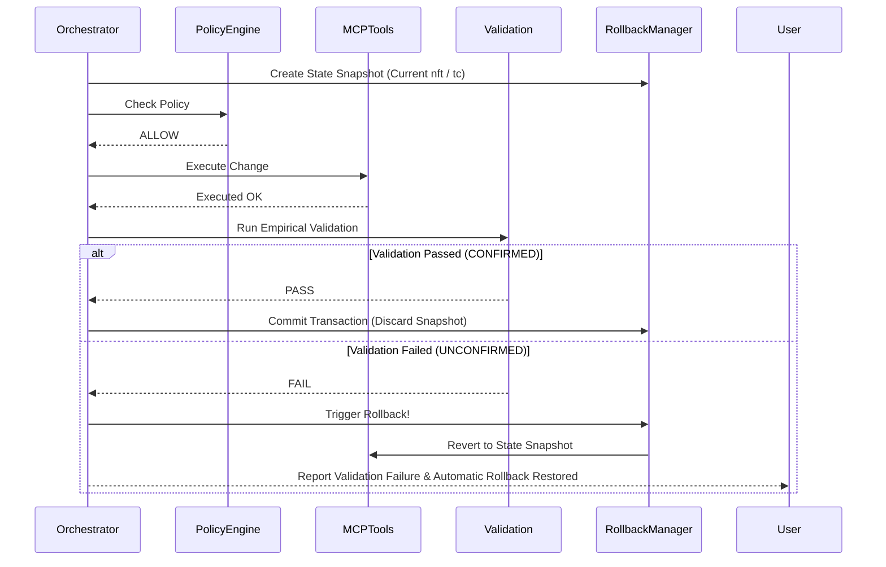

# Report 05: Edge Cases, System Limitations & Future Network Improvements

---

## 1. Executive Summary

This report delivers an exhaustive technical breakdown of **network edge cases, system limitations, root-cause analyses, and advanced network engineering proposals** for the **Intelligent Network Configuration Assistant (INA)**.

While the current implementation achieves high accuracy in container isolation and rate limiting, real-world deployment introduces edge cases ranging from bridge netfilter bypasses to control socket collisions. This document analyzes these failure modes and outlines technical roadmaps for eBPF/XDP filtering, ingress shaping via IFB devices, dynamic Docker CNI integration, and transactional rollback mechanisms.

---

## 2. Exhaustive Edge Case Analysis & Root-Cause Matrix

| Edge Case | Failure Symptoms / Error | Root Cause Analysis | Implemented Solution / Mitigation |
| :--- | :--- | :--- | :--- |
| **1. Host Ping Bypass** | `check_block()` reports `0% packet loss` (Client Reachable) even after applying `nftables` DROP rule. | Ping issued from Host/Controller uses Layer-3 host routing, bypassing Layer-2 bridge forwarding hooks. | `pick_source_container()` forces ping to execute from a sibling container (e.g. `client2`), routing traffic through the bridge hook. |
| **2. Stale `iperf3` Control Socket** | `iperf3: error - control socket has closed unexpectedly`. | Server daemon (`iperf3 -s`) crashed or had a hung TCP connection on port `5201` from a previous test run. | `ensure_iperf_server()` probes port `5201` via `ss -lnt` and restarts daemon in background (`iperf3 -s -D`) if missing. |
| **3. Duplicate Block Request** | `nft` command returns Exit Code `1` with `Error: File exists`. | Adding an IP to `blocked_clients` set when the IP is already present in the set. | [`mcp_server/tools.py`](file:///home/dhruv/Documents/ina/mcp_server/tools.py) intercepts `File exists` in `stderr` and returns `status: success` (`already blocked`). |
| **4. Duplicate Unblock Request** | `nft` command returns Exit Code `1` with `Error: No such element`. | Deleting an IP from `blocked_clients` set when the IP is not currently blocked. | [`mcp_server/tools.py`](file:///home/dhruv/Documents/ina/mcp_server/tools.py) intercepts `No such element` and returns `status: success` (`already unblocked`). |
| **5. Out-of-Bounds Rate Request** | User asks to limit bandwidth to `50 Mbps` or `0.5 Mbps`. | Requested rate violates network policy rules. | Policy Engine checks [`policy/rules.yaml`](file:///home/dhruv/Documents/ina/policy/rules.yaml) (`1mbit`–`20mbit`) and issues Policy DENY before MCP invocation. |
| **6. Protected Server Isolation** | User asks to block `server` node (`172.20.0.3`). | Would disconnect the target HTTP/iperf3 server, causing total system collapse. | Policy Engine identifies `server` in `protected_clients` and permanently denies block/limit actions against it. |
| **7. Malformed LLM Output** | LLM outputs markdown fences ` ```json ... ``` ` or raw text. | Non-deterministic output formatting by cloud LLM endpoints. | `_extract_json()` strips markdown fences and uses fallback regex pattern matching `\{.*\}` to extract JSON payload safely. |
| **8. Offline / API Outage** | `OPENROUTER_API_KEY` missing or API endpoint unreachable. | Cloud LLM service unavailable. | Assistant automatically switches to deterministic `regex_parse()`, ensuring 100% offline functionality. |

---

## 3. Comprehensive Analysis of System Limitations

### 3.1 Evolution from Hardcoded IP Mappings (`CLIENT_IPS`) to Dynamic Container Discovery

* **Previous Limitation**: Client hostnames and IP addresses were previously hardcoded across tools and monitor modules via static dictionaries (`CLIENT_IPS = {"client1": "172.20.0.2", ...}`).
* **Implemented Solution**: Replaced static dictionaries with runtime container discovery using the **Docker SDK for Python** (`docker.from_env()`) in [`network/discovery.py`](file:///home/dhruv/Documents/ina/network/discovery.py). The system dynamically inspects running containers on the project bridge network and resolves IP addresses in real time.


### 3.2 Egress-Only Traffic Shaping

* **Limitation**: The `tc qdisc replace dev eth0 root tbf ...` command is applied directly to the root qdisc of `eth0`, which controls **egress (outgoing)** traffic only.
* **Impact**: Ingress (incoming) bandwidth is unthrottled. If `client2` sends data to `client1` at 10 Gbps, `client1`'s egress limit of 5 Mbps will only throttle its ACK responses, not the incoming TCP payload stream.

### 3.3 Absence of Transactional Rollback Pipeline

* **Limitation**: If an operation passes Policy check and executes via MCP, but **fails validation** (e.g. `iperf3` fails due to noise), the network state remains modified (`UNCONFIRMED` status reported).
* **Impact**: The network is left in an unverified state without automatic rollback to the previous configuration.

---

## 4. Advanced Technical Improvement Proposals

### 4.1 Proposal 1: eBPF / XDP Filtering for High-Performance Block Operations

Instead of using Layer-2 `nftables` bridge hooks, future iterations should deploy **eBPF (Extended Berkeley Packet Filter)** programs using **XDP (eXpress Data Path)** directly on virtual Ethernet drivers (`veth`).

```text
[ Incoming Packet on veth ]
            │
            ▼
+-------------------------------------------------------+
|  eBPF / XDP Driver Hook (XDP_DROP / XDP_PASS)          |  <--- Direct Kernel CPU Ring Buffer
+-------------------------------------------------------+
      │ (XDP_DROP)                     │ (XDP_PASS)
      ▼                                ▼
[ Drop Frame (Zero Copy) ]     [ Pass to Linux Network Stack ]
```

* **Benefits**:
  * Drops packets at the network driver level before allocating Linux `sk_buff` kernel memory buffers.
  * Achieves wire-speed filtering capable of handling millions of packets per second (Mpps) during DDoS attacks.
  * Dynamically updates blocked IPs via eBPF BPF_MAP_TYPE_HASH maps.

### 4.2 Proposal 2: Ingress Traffic Control via IFB (Intermediate Functional Block)

To implement true bi-directional bandwidth shaping (Ingress + Egress), Linux **IFB pseudo-devices** should be used.

#### Implementation Architecture:
1. Load `ifb` kernel module: `modprobe ifb numifbs=1`.
2. Redirect ingress traffic from `eth0` to `ifb0` using `tc filter`:
   ```bash
   # Enable ingress qdisc on eth0
   tc qdisc add dev eth0 handle ffff: ingress

   # Redirect all ingress traffic to ifb0
   tc filter add dev eth0 parent ffff: protocol ip u32 match u32 0 0 action mirred egress redirect dev ifb0

   # Apply TBF bandwidth rate limit on ifb0
   tc qdisc add dev ifb0 root tbf rate 5mbit burst 32kbit latency 400ms
   ```

### 4.3 Proposal 3: Automated Two-Phase Commit & Rollback Pipeline

To ensure network state integrity, implement a **Transactional Rollback Pipeline** inside `assistant/client.py`:



### 4.4 Implemented Solution: Dynamic Docker Engine API Integration (`network/discovery.py`)

The hardcoded `CLIENT_IPS` dictionary has been completely replaced with dynamic container discovery using the **Docker SDK for Python** (`docker.from_env()`) implemented in [`network/discovery.py`](file:///home/dhruv/Documents/ina/network/discovery.py):

```python
from network.discovery import get_container_ip, list_known_clients

# Dynamically resolve client IP from Docker Engine API
client_ip = get_container_ip("client1")

# List all running containers on project-net
active_clients = list_known_clients()
```


---

## 5. Key Takeaways for Examination

1. **What is the root cause of the Host Ping Bypass?**  
   Host-originated pings originate in Layer-3 OUTPUT chains, bypassing Layer-2 bridge forwarding hooks. Solved by forcing sibling container pings.
2. **How does XDP / eBPF improve upon `nftables`?**  
   XDP drops packets at the network card driver level before allocating kernel packet buffers (`sk_buff`), drastically reducing CPU overhead.
3. **How can ingress traffic be limited using `tc`?**  
   By redirecting ingress packets to an Intermediate Functional Block (`ifb`) interface using `tc filter mirred` and applying a TBF qdisc on `ifb0`.
